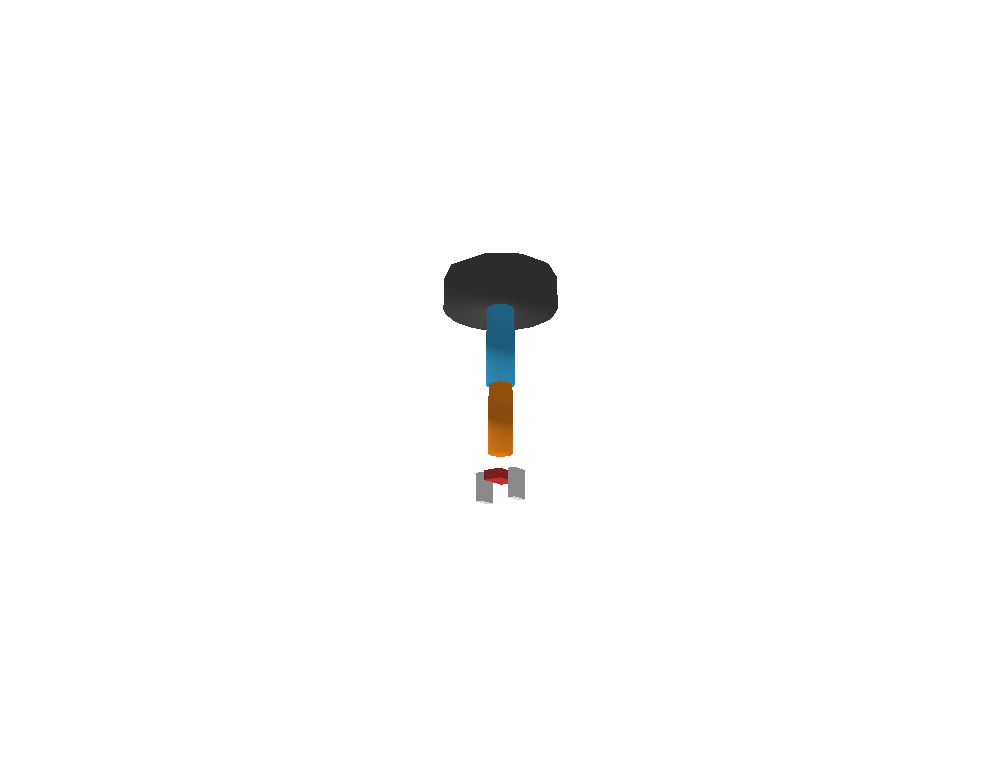
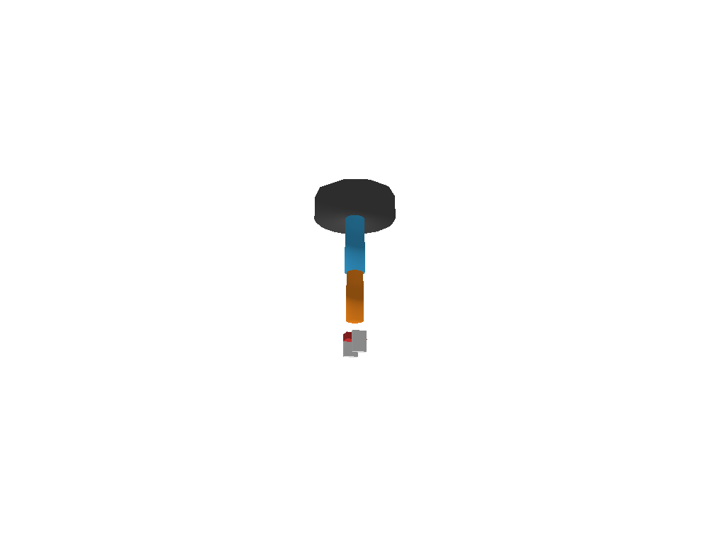
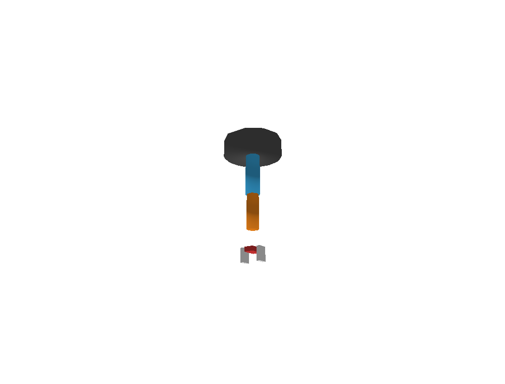
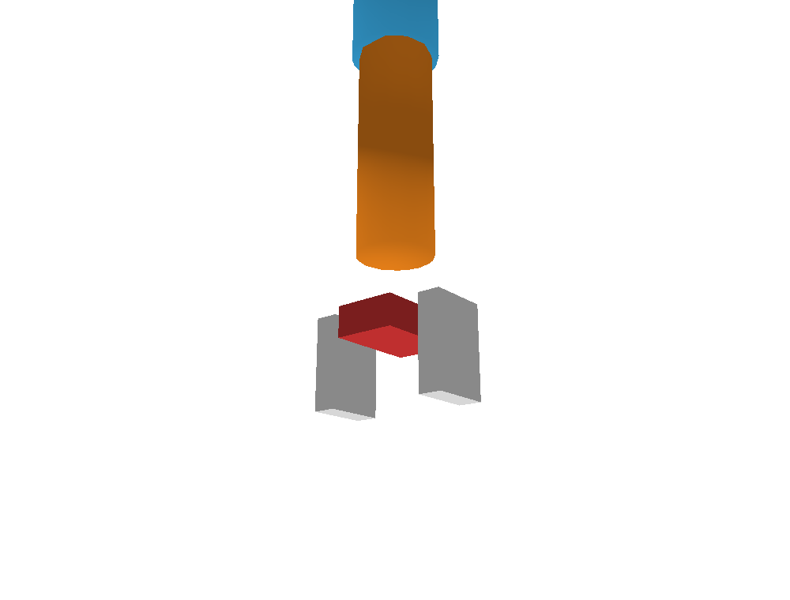
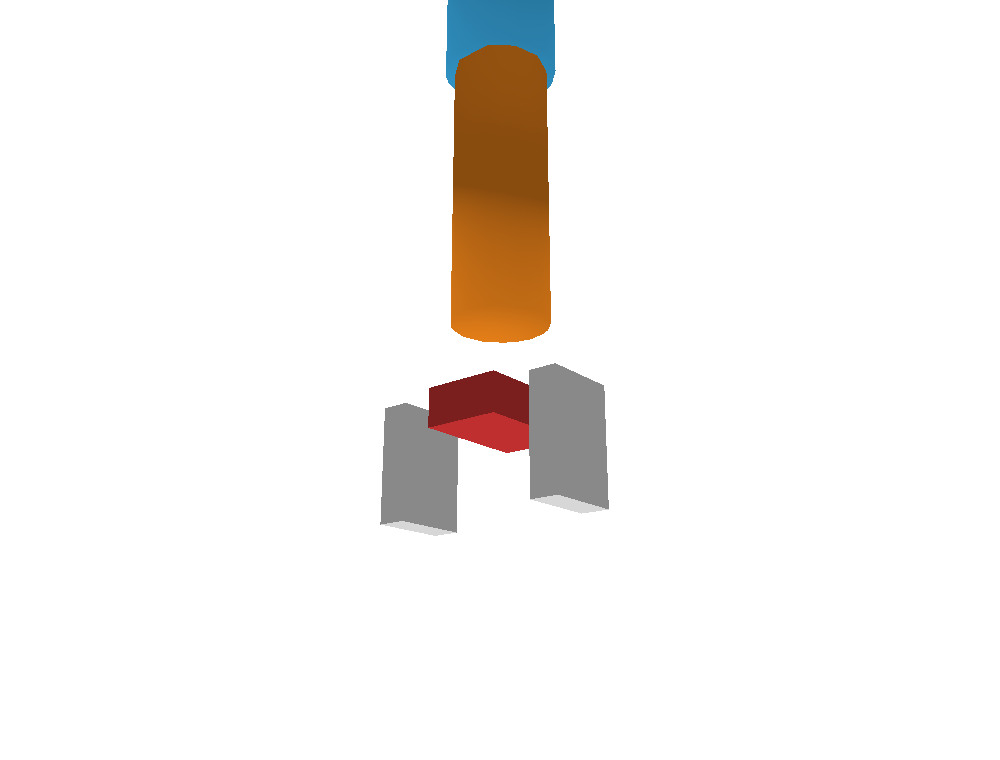
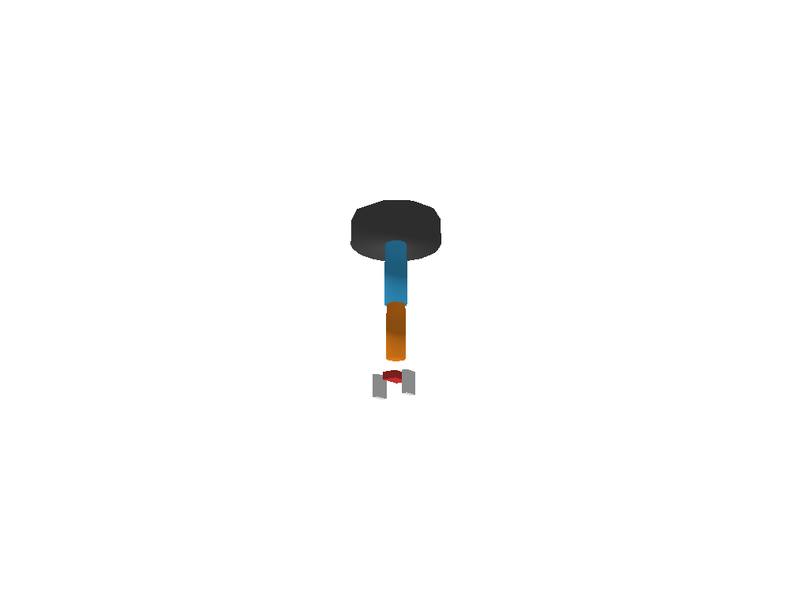
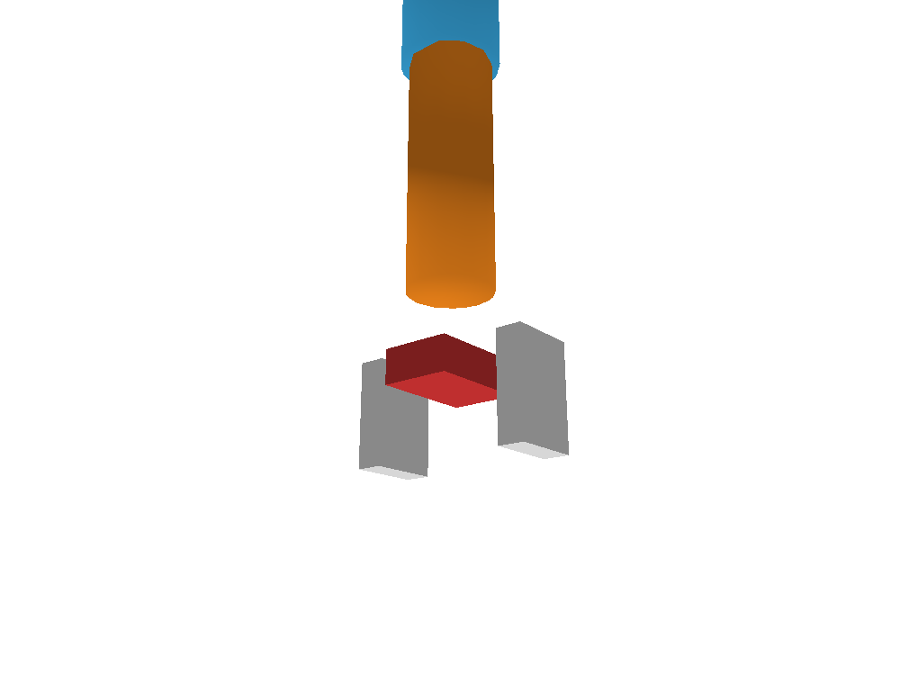
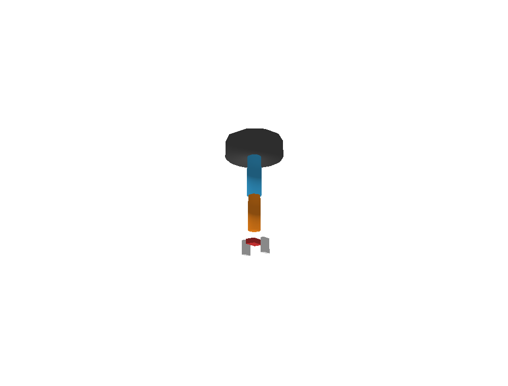

# Brazo robotico URDF con ESP32

Proyecto independiente para simular en PyBullet un brazo de cinco ejes y controlarlo con cinco potenciometros conectados a una ESP32 DevKit V1. La ESP32 lee las entradas analogicas y envia sus posiciones por USB-UART; Python recibe las lecturas y mueve las articulaciones del modelo URDF.

## Archivos incluidos

- `main.py`: simulacion PyBullet, lectura UART, limites y modo demo.
- `brazo.urdf`: geometria y limites de las cinco articulaciones.
- `environment.yml`: entorno reproducible de Python con PyBullet y PySerial.
- `firmware/`: proyecto PlatformIO que lee la ESP32 y transmite las cinco posiciones.
- `capturas/`: evidencia visual de las posiciones de referencia y de cada eje.

## Materiales

- ESP32 DevKit V1 y cable USB de datos.
- Cinco potenciometros **lineales de 10 kOhm** (marcados normalmente `B10K`).
- Protoboard y cables Dupont.

El valor de 10 kOhm es adecuado para la entrada ADC y mantiene baja la corriente. No uses potenciometros alimentados con 5 V: las entradas de la ESP32 aceptan como maximo 3.3 V.

## Cableado paso a paso

Haz el montaje con la placa desconectada del USB.

1. Conecta `3V3` de la ESP32 al riel positivo de la protoboard.
2. Conecta un pin `GND` de la ESP32 al riel negativo. Si los rieles estan partidos en la mitad, puentea cada seccion para que haya continuidad.
3. Coloca los cinco potenciometros. Cada uno tiene dos terminales exteriores y uno central (cursor); ponlos en filas distintas.
4. En cada potenciometro, conecta un terminal exterior al riel `3V3` y el otro al riel `GND`.
5. Conecta el terminal central de cada potenciometro al GPIO de la tabla.
6. Revisa que no haya un puente directo entre `3V3` y `GND`; conecta el USB solo despues de comprobar el cableado.

| Potenciometro | Articulacion y movimiento | Cursor central | Rango de movimiento |
| --- | --- | --- | --- |
| P1 | `joint_1`, giro de la base | GPIO 32 | -2.5 a 2.5 rad |
| P2 | `joint_2`, inclinacion del brazo | GPIO 33 | -2.0 a 2.0 rad |
| P3 | `joint_gripper`, desplazamiento vertical de la pinza | GPIO 34 | 0 a 0.15 m |
| P4 | `joint_dedo_izq`, movimiento del dedo izquierdo | GPIO 35 | 0 a 0.05 m |
| P5 | `joint_dedo_der`, movimiento del dedo derecho | GPIO 36 / VP | 0 a 0.05 m |

```text
Riel 3V3 ────────── terminal exterior de P1, P2, P3, P4 y P5
GPIO 32 ─────────── cursor central de P1
GPIO 33 ─────────── cursor central de P2
GPIO 34 ─────────── cursor central de P3
GPIO 35 ─────────── cursor central de P4
GPIO 36 / VP ────── cursor central de P5
Riel GND ────────── otro terminal exterior de P1, P2, P3, P4 y P5
ESP32 GND ───────── riel GND
```

Los GPIO 34, 35 y 36 son solo de entrada y sirven para leer los cursores analogicos. Si un eje gira al reves, intercambia los dos terminales exteriores de ese potenciometro; no cambies el cursor de GPIO.

## Como se convierte la lectura

El ADC de 12 bits entrega un valor de 0 a 4095. El firmware lo transforma linealmente entre los limites definidos en el URDF:

```text
posicion = limite_inferior + (ADC / 4095) * (limite_superior - limite_inferior)
```

| Potenciometro | ADC 0 | ADC 2048 (aprox. centro) | ADC 4095 |
| --- | --- | --- | --- |
| P1 / base | -2.5 rad | 0 rad | 2.5 rad |
| P2 / brazo | -2.0 rad | 0 rad | 2.0 rad |
| P3 / altura de pinza | 0 m | 0.075 m | 0.15 m |
| P4 / dedo izquierdo | 0 m | 0.025 m | 0.05 m |
| P5 / dedo derecho | 0 m | 0.025 m | 0.05 m |

**Nota sobre la pinza:** `joint_gripper` mueve el conjunto de la pinza hacia arriba o abajo. La apertura horizontal se representa con las articulaciones independientes de los dedos P4 y P5.

## Capturas de los ejes

Las capturas se renderizaron desde PyBullet con el mismo URDF y la conversion ADC del firmware. La imagen de referencia usa ADC 2048 en los cinco potenciometros. En cada imagen siguiente solo cambia un potenciometro a ADC 4095; los otros cuatro permanecen en 2048.

### Referencia: todos los potenciometros al centro



### P1: giro de la base, ADC 4095



### P2: inclinacion del brazo, ADC 4095


### P3: desplazamiento vertical de la pinza, ADC 4095



### Detalle de la pinza: referencia con P4 y P5 en ADC 2048



### P4: dedo izquierdo, ADC 4095





### P5: dedo derecho, ADC 4095





Estas son capturas de la simulacion con entradas ADC controladas, no fotografias de la protoboard ni mediciones reales de los potenciometros.


3. Antes del primer commit, verifica que aparezcan `main.py`, `brazo.urdf`, `environment.yml`, `README.md`, `capturas/` y `firmware/`.
4. Confirma los cambios y publica el repositorio. El `.gitignore` del paquete excluye entornos Python, archivos temporales y la carpeta `.pio` que PlatformIO genera al compilar.
